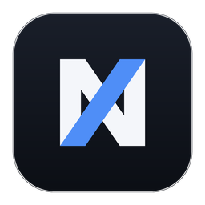

  

<h1 align="center">NaX</h1>

  <b>Le navigateur qui range vos onglets à votre place.</b> 
  Open source · basé sur Chromium · Windows

  
  

  <a href="https://github.com/TymCodeFast/nax/releases/latest"><b>⬇ Télécharger NaX</b></a>

  

---

NaX regroupe vos onglets pendant que vous travaillez. Une page ouverte depuis une autre reste
avec elle, les onglets oubliés s'endorment, et tout ce que vous avez ouvert reste à portée de
recherche (Ctrl+K). Vous n'avez rien à ranger.

- **Onglets groupés automatiquement**, repliables, et renommables.
- **Mise en veille** des onglets inactifs, et archive pour les plus anciens.
- **Applis dans un rail** : Gmail avec ses mails non lus, Agenda, Drive, et vos propres sites.
- **Mots de passe chiffrés** par le coffre Windows, favoris en arbre, téléchargements.
- **Page d'accueil** avec une barre de recherche, qui suit votre moteur préféré.

---

## Installer

1. Téléchargez `NaX-Setup-x.y.z.exe` depuis la [page des releases](https://github.com/TymCodeFast/nax/releases/latest).
2. Lancez-le. Windows peut afficher un avertissement, car l'installeur n'est pas encore signé : cliquez sur « Informations complémentaires », puis « Exécuter quand même ».

Les mises à jour sont proposées automatiquement, et rien ne s'installe sans votre accord.

---

## Développer

Prérequis : Node.js.

    npm install
    npm start

Une seule instance de NaX par profil : fermez la version installée avant de lancer `npm start`.

Pour contribuer, travaillez sur une branche issue de `develop` et ouvrez une pull request vers `develop`.

---

## Licence

MIT. Voir [LICENSE](LICENSE).
