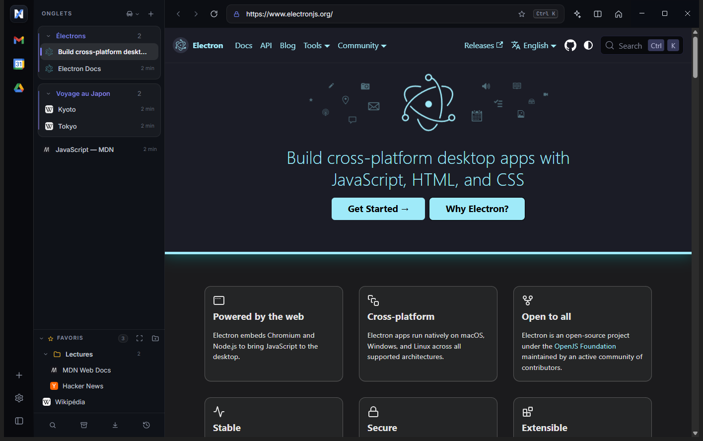

# NaX

**Le navigateur qui range vos onglets à votre place.**

NaX est un navigateur **open source** basé sur Chromium. Il organise vos onglets pendant que
vous travaillez : les pages ouvertes depuis une autre restent ensemble, les onglets oubliés
partent en veille, et rien ne disparaît jamais.

[**Télécharger NaX**](https://github.com/TymCodeFast/nax/releases/latest) · Windows 10 et 11 · Gratuit · Licence MIT

---

## Pourquoi NaX ?

Un navigateur classique finit toujours avec quarante onglets et aucun moyen de les retrouver.
Tout le monde a promis de les ranger plus tard. NaX prend le problème dans l'autre sens :
**on organise après, ou jamais.**

- **Des onglets qui se rangent seuls.** Une page ouverte depuis une autre reste collée à sa
  source. Vos recherches et vos projets forment des groupes sans effort.
- **Un ménage automatique.** Un onglet inactif depuis 2 h passe en veille. Un onglet fermé
  ou en veille depuis 3 jours part dans l'archive. Un clic le ramène.
- **Rien ne se perd.** Tout ce qui a été ouvert, fermé ou mis en veille se retrouve dans la
  recherche globale (Ctrl+K).
- **Vos applis à portée de clic.** Gmail, Agenda et Drive vivent dans un rail, à côté de
  vos onglets, sans prendre la place des onglets.
- **Vos mots de passe, en sécurité.** Le coffre est chiffré par le coffre Windows : jamais
  en clair sur le disque.
- **Open source et gratuit.** Le code est public, sous licence MIT. Vous pouvez le lire,
  le modifier, le partager.

---

## Fonctionnalités

### Des onglets qui s'organisent seuls

- **Îlots automatiques** : une page ouverte avec Ctrl+clic, depuis un lien dans une autre
  page, ou par clic droit → nouvel onglet, reste groupée avec celle qui l'a ouverte. Le nom
  du groupe est deviné automatiquement, et se renomme d'un double-clic.
- **Groupes repliables** : un clic réduit un groupe à une seule barre (nom, favicons empilés,
  compteur). Il se déplie d'un autre clic, et NaX se souvient de l'état.
- **Pas de doublons** : taper l'adresse d'une page déjà ouverte vous y ramène. Ctrl+Entrée
  force un nouvel onglet.
- **Veille et archive** : les onglets inactifs s'endorment grisés, sans perdre leur place.

### Une organisation à la souris

Tout se range par glisser-déposer dans la liste des onglets :

- **Réordonner** : une ligne indique où l'onglet va tomber.
- **Grouper** : déposer un onglet sur un autre le réunit en groupe ; déposer sur un groupe
  existant l'y ajoute.
- **Dégrouper** : sortir un onglet de son groupe, ou déplacer le groupe entier par son en-tête.

Le clic droit donne accès aux mêmes actions au clavier et à la souris.

### Vos applis dans le rail

- **Gmail** : un widget maison affiche vos mails non lus (expéditeur, objet, extrait, heure),
  avec la session déjà connectée. Une pastille indique le nombre de non-lus. Un clic ouvre le
  mail dans Gmail.
- **Agenda, Drive et vos sites** : un clic les ouvre. Ajoutez n'importe quel site avec `+`,
  retirez-le par clic droit.

### Favoris en arbre

- Dossiers et sous-dossiers, glisser-déposer, renommage au double-clic.
- Étoile dans la barre d'adresse, ou Ctrl+D.
- Clic droit sur un dossier → ouvrir tous ses liens d'un coup.

### Mots de passe

- Coffre local, chiffré par le coffre Windows (DPAPI).
- Import depuis Chrome par export CSV.
- Révélation, copie (le presse-papiers est effacé après 30 s), ouverture et suppression.

### Un navigateur complet

- **Recherche dans la page** (Ctrl+F), impression, enregistrement de page (HTML, MHTML).
- **Téléchargements** avec progression, et un panneau pour ouvrir ou montrer le fichier.
- **Partage d'écran** pour Meet, Teams ou Zoom web, avec option son de l'ordinateur.
- **Permissions par site** : caméra, micro, notifications, géolocalisation.
- **Sessions privées** : les autorisations accordées sont oubliées à la fermeture.
- **Pages d'erreur et page figée** : une page claire explique le problème et propose de réessayer.
- **Liens vers d'autres applis** (Teams, Zoom, Slack, `mailto:`…) : NaX demande avant de les
  ouvrir. Les schémas dangereux restent bloqués.
- **Navigateur par défaut** : enregistré depuis les Réglages, validé dans les paramètres Windows.
- **Export en Markdown** : un clic transforme une page en texte propre, prêt à coller.
- **Recherche intelligente** dans la barre d'adresse : onglets, favoris, historique et suggestions
  de recherche, avec complétion.
- **Thème** clair, sombre ou automatique. Moteur de recherche au choix (Google, DuckDuckGo,
  Bing, Qwant, Ecosia, Brave, Startpage).
- **Mode développeur** : vos serveurs de développement locaux apparaissent dans le rail dès
  qu'ils tournent, et disparaissent à l'arrêt.

---

## Installer NaX

1. Ouvrez la [page des Releases](https://github.com/TymCodeFast/nax/releases/latest) et
   téléchargez `NaX-Setup-x.y.z.exe`.
2. Double-cliquez dessus et choisissez le dossier d'installation. Les raccourcis Démarrer et
   bureau sont créés.
3. L'application n'est pas encore signée par un éditeur reconnu : Windows SmartScreen peut
   afficher un avertissement. Cliquez sur « Informations complémentaires », puis sur
   « Exécuter quand même ».

Vos données (favoris, mots de passe, réglages, onglets) sont stockées dans
`%APPDATA%/NaX`. Elles survivent aux mises à jour, et la désinstallation ne les efface pas.

### Mises à jour automatiques

NaX vérifie au démarrage, puis toutes les 6 heures, si une version plus récente est publiée.
Si oui, une bulle discrète en bas à droite vous le propose. Rien ne se télécharge sans votre
accord : un clic sur « Télécharger », puis « Redémarrer » pour installer. Vous pouvez aussi
choisir « Plus tard ».

---

## Raccourcis clavier

| Touche | Action |
|---|---|
| Ctrl+T / Ctrl+W | nouvel onglet / fermer |
| Ctrl+Shift+N | nouvel onglet privé |
| Ctrl+Shift+T | rouvrir le dernier onglet fermé |
| Ctrl+L / Alt+D / F6 | barre d'adresse |
| Ctrl+K | rechercher partout |
| Ctrl+B | replier la liste des onglets |
| Ctrl+Tab | dernier onglet utilisé |
| Ctrl+PgSuiv / Ctrl+PgPréc | onglet suivant / précédent |
| Ctrl+1 … Ctrl+8 / Ctrl+9 | n-ième onglet / dernier onglet |
| Alt+← / Alt+→ | précédent / suivant |
| Alt+Début | page d'accueil |
| Ctrl+R, F5 / Ctrl+Shift+R, Ctrl+F5 | recharger / recharger sans le cache |
| Ctrl+F | rechercher dans la page |
| Ctrl+D | ajouter ou retirer des favoris |
| Ctrl+H / Ctrl+J | historique / téléchargements |
| Ctrl+Shift+Suppr | effacer les données de navigation |
| Ctrl+S / Ctrl+P | enregistrer la page / imprimer |
| Ctrl+U | code source de la page |
| Ctrl+= / Ctrl+- / Ctrl+0 | zoom |
| F11 | plein écran |
| F12 / Ctrl+Shift+I | outils de développement (page / interface) |

---

## Feuille de route

- Pastilles de notification sur les applis (événement proche, etc.).
- Vue « récurrents » calculée depuis l'historique.
- Remplissage automatique des formulaires web.
- Applis en panneau latéral, en plus du plein écran.

---

## Pour les développeurs

### Lancer en dev

Prérequis : Node.js et `npm install` (une fois).

    npm start

Pour une démo sans vos données (profil séparé, onglets neutres) : `npm run demo`. Le profil
de démo est `%APPDATA%/NaX-demo` et ne touche jamais le profil réel.

### Structure

- `main.js` : processus principal. Une fenêtre, une vue d'interface qui la couvre, et une seule
  vue de contenu (onglet ou appli) posée par-dessus. Modèle des onglets, groupes, applis,
  archive, historique et veille.
- `preload.js` : pont IPC exposé à l'interface (`window.api`).
- `ui/` : interface (rail, liste d'onglets, barre de navigation, palette, menus, tooltips,
  overlays de suggestions et de recherche). Les fenêtres overlay ont chacune leur
  `*-preload.js`.
- État persisté dans `%APPDATA%/browser/state.json`.

Pour ajouter un réglage : un `.settings-navitem` dans la nav, une `.settings-pane` dans le
contenu (`ui/index.html`), et le câblage dans `ui/app.js`.

Les constantes (délai de veille, délai d'archive, page d'accueil, applis par défaut) sont en
tête de `main.js`.

### Construire l'installeur

    npm run dist

Résultat : `dist/NaX Setup x.y.z.exe` (installeur NSIS) et `dist/win-unpacked/NaX.exe`.
L'installeur crée aussi les clés de navigateur par défaut (`HKCU`, sans droits admin) et
les retire à la désinstallation, mais pas lors d'une mise à jour (`build/installer.nsh`).

### Versions

Un seul numéro, dans `package.json` (`version`). Il est affiché dans l'installeur,
Réglages → À propos, et utilisé par les mises à jour automatiques. Schéma
[semver](https://semver.org/lang/fr/) :

| Numéro | Étape |
|---|---|
| `0.0.x` | bêta fermée (historique) |
| `0.1.x`, `0.2.x`… | **bêta** (actuelle) |
| `1.0.0` | première version stable |

L'auto-update ne propose **jamais une version inférieure ou égale** à celle installée.
Ne republiez jamais un numéro déjà publié.

### Publier une version

1. Incrémenter la version : `npm run bump` (patch, `0.1.0` → `0.1.1`) ou `npm run bump:minor`.
   Aucun tag Git n'est créé ici : c'est la publication qui s'en charge.
2. Créer un jeton GitHub avec la portée `repo`, puis l'exposer :

        # PowerShell
        $env:GH_TOKEN = "ghp_xxx"
        npm run publish

   electron-builder construit l'installeur et crée une Release GitHub taguée `v<version>`,
   avec `NaX-Setup-<version>.exe` et `latest.yml`, le fichier que l'app lit pour détecter les
   mises à jour.

Le dépôt étant public, les utilisateurs n'ont besoin d'aucun jeton pour recevoir les mises à jour.

### Contribuer

Les contributions sont bienvenues : ouvrez une issue pour discuter d'une idée, puis une pull
request. Le projet est une application Electron sans chaîne de build complexe.

---

## Licence

MIT. Voir [LICENSE](LICENSE).
